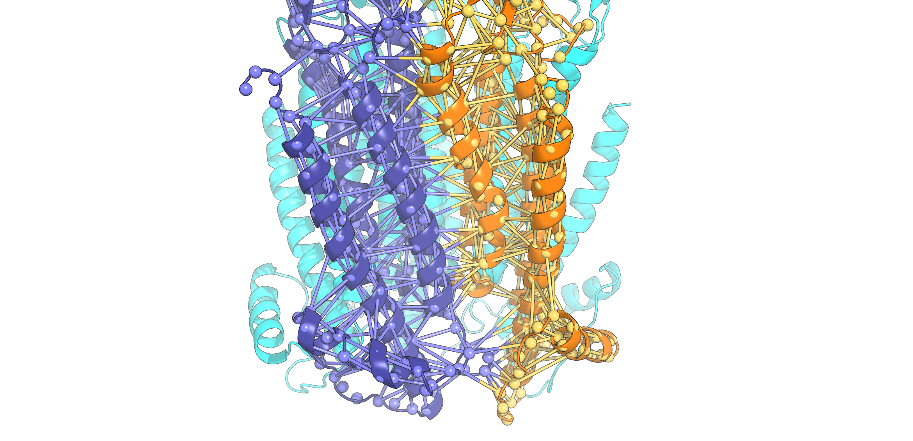

# Visualise_martini_bond_network

### Dependencies 
* PyMOL
* Pandas

The `create_martini_contacts.py` script allows for visualising the martini bond/contact network in PyMOL.
This includes:
* Normal martini bonds, i.e. backbone bonds
* Elastic network 
* Elnedyn
* GoMartini contacts 

See figure below for visulising GoMartini network for the nicotinic acetycholine receptor (nAChR):

### Tutorial for visualisation:
1. Load the coarse grained nAChR structure (`NCT_CG.pdb`) into PyMOL (This was created using [`go_martizine.py`](http://info.ifpan.edu.pl/~panos/panos/GoMartini.html))
2. Load the create_martini_contacts.py script into PyMOL (`run create_martini_contacts.py`) 
3. Copy the bonds/contacts into a sepearate file (i.e. `bond_pairs.itp`)
    * In the case of GoMartini, the contacts are defined in the `[ pairs ]` section of the GROMACS `.itp` file. 
    * Copy all the pairs without the `[ pairs ]` header
    * If you wanted to visualise the elastic network or elnedyn, copy the lines with the `RUBBER_FC`
    * Ditto for any other bonds, i.e. normal Martini backbone bonds 
4. In PyMOL, run `create_martini_contacts NCT_CG, bond_pairs.itp`
5. To help visualise the bonds
   * Color the protein chains in different colors 
   * Hide sidechain beads 
   * Show backbone beads as sphere 
   * Make backbone beads smaller, `set sphere_scale, 0.5`
